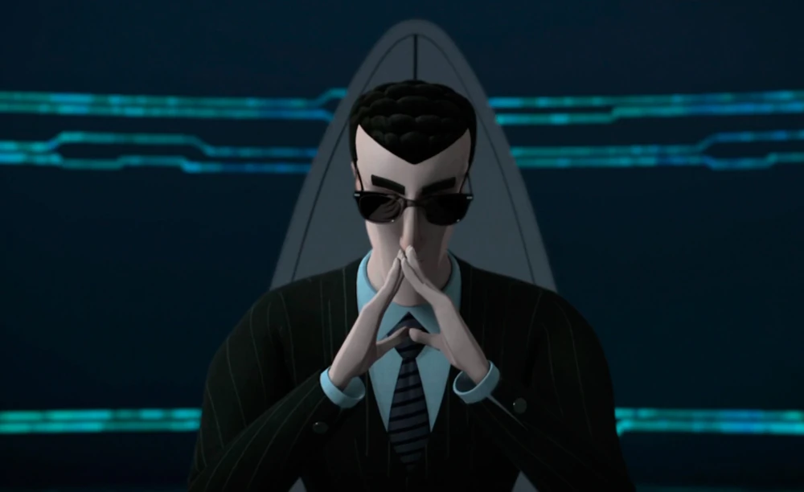

  <!-- Left side: Details -->
  

    <h3 style="margin: 0; font-size: 24px; text-transform: uppercase; letter-spacing: 2px; 
               text-shadow: 0 0 8px #00FF00;">
      Collins' page
    </h3>
    
    

      > STATUS: Online
      > ROLE: Go Developer & Enthusiast 
    

  

  <!-- Right side: Agent Bishop image -->
  

    
  

